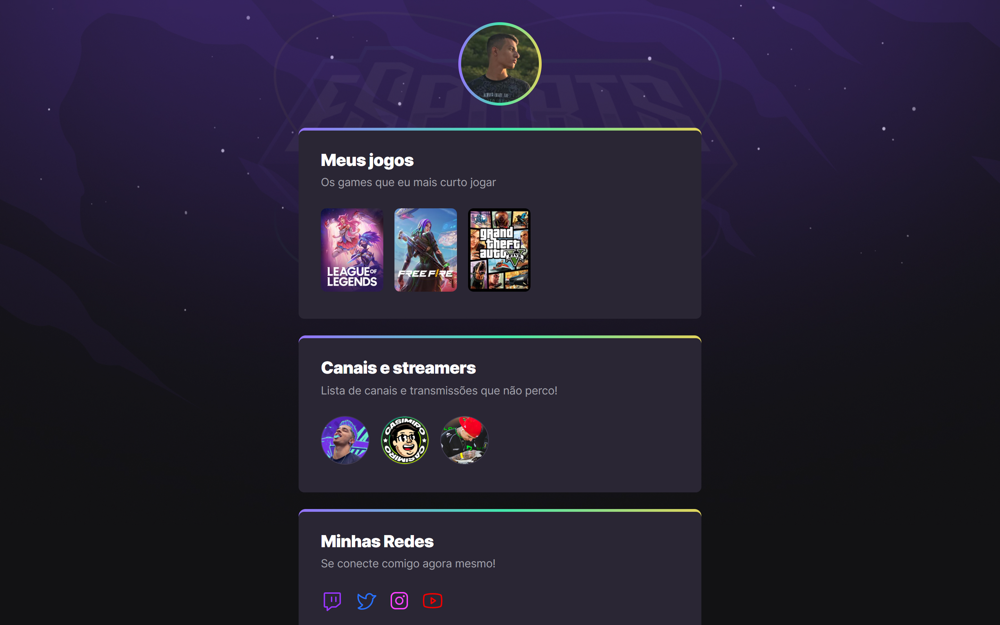

# NLW eSports

 >Trilha Explorer

Projeto construído no evento Next Level Week da Rocketseat.

[Clique aqui para acessar](https://maik-emanoel.github.io/nlw-9/)

## O que aprendi?

Neste evento obtive maior entendimento sobre algumas questões do CSS, como por exemplo: keyframes, entre outras coisas. E também aprendi algumas funções no Github que eu desconhecia.

## Tecnologias

- HTML
- CSS
- Git e Github